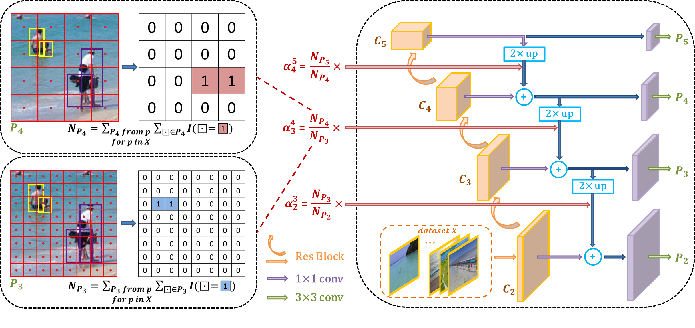

# Effective Fusion Factor
Effective Fusion Factor in FPN for Tiny Object Detection(WACV2021) [paper](https://arxiv.org/pdf/2011.02298.pdf)

## Tiny Benchmark S-α
The benchmark is based on [tiny_benchmark](https://github.com/ucas-vg/TinyBenchmark), [maskrcnn_benchmark](https://github.com/facebookresearch/maskrcnn-benchmark) and [citypersons code](https://bitbucket.org/shanshanzhang/citypersons/src/default/evaluation/).

## Dataset
The relevant data sets can be downloaded at [tiny_benchmark](https://github.com/ucas-vg/TinyBenchmark).

## To do list

## Citation

